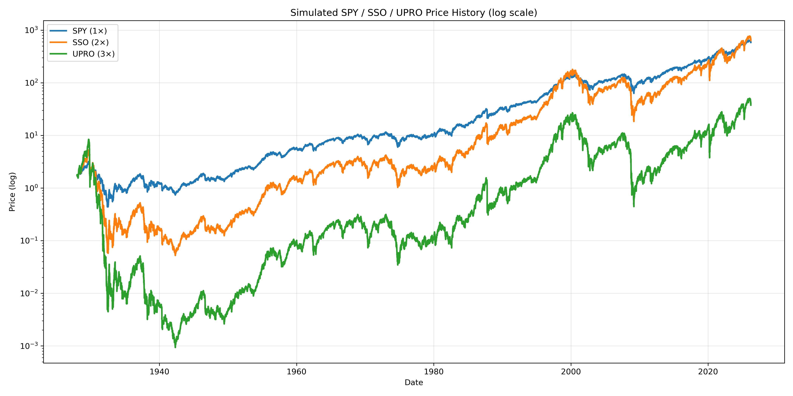
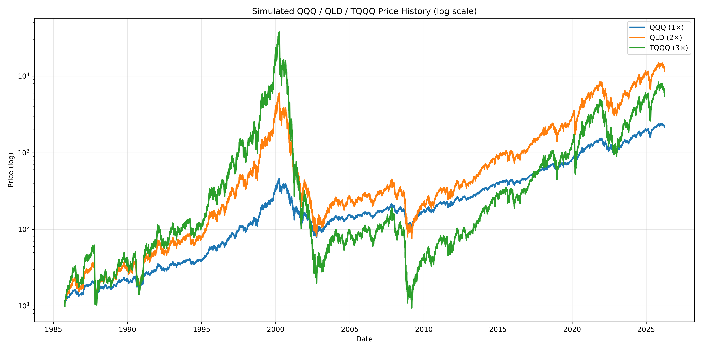
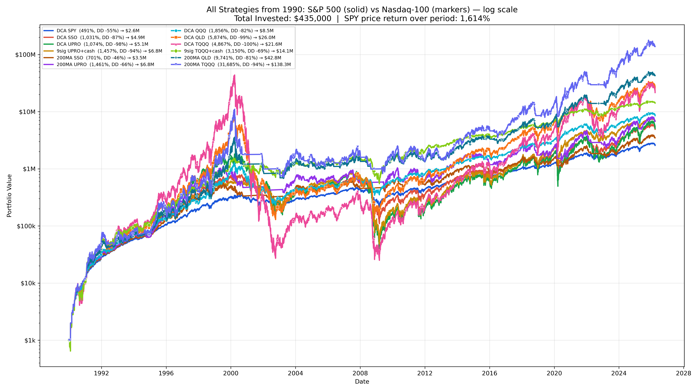
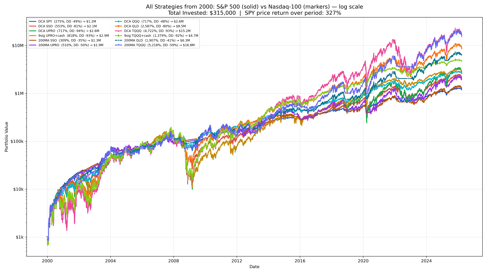
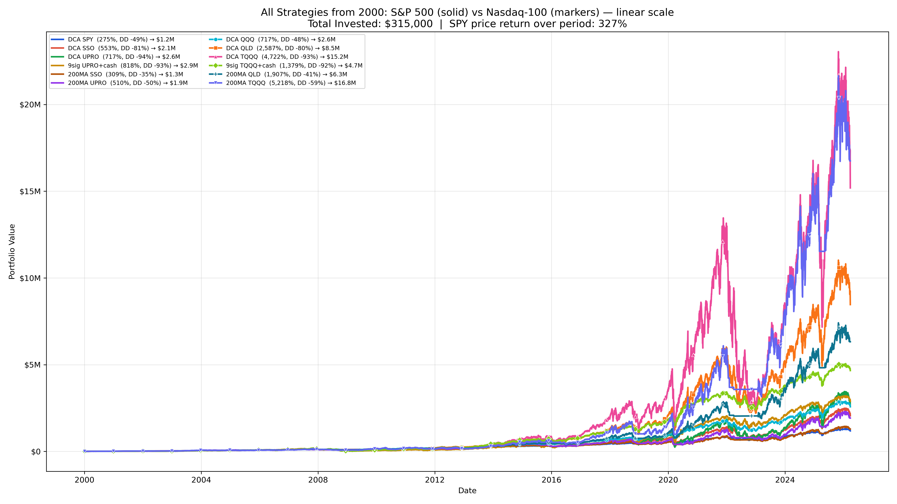
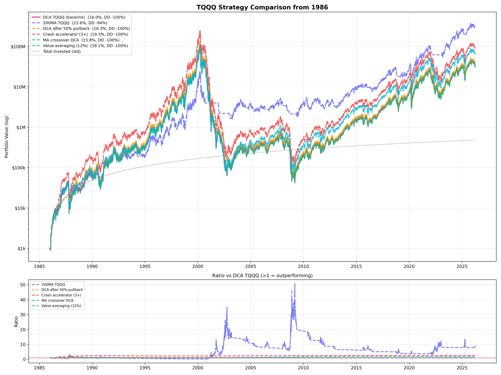
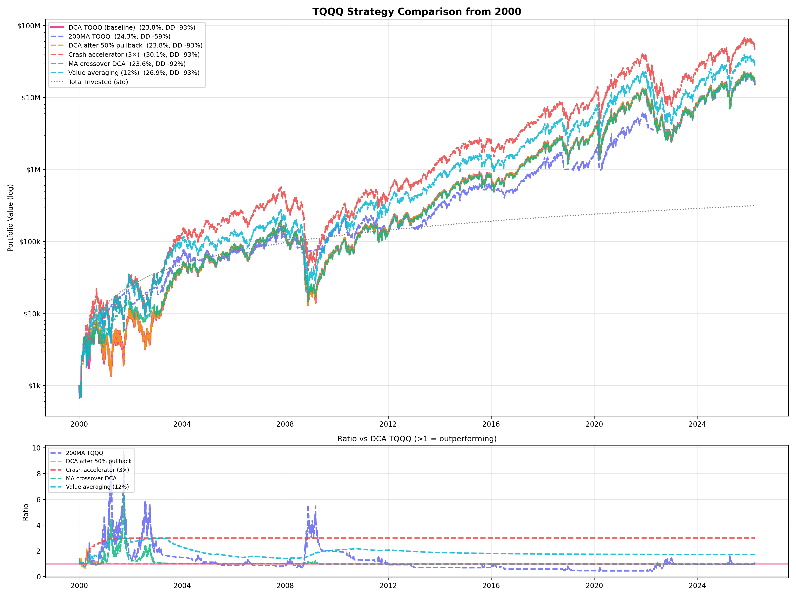
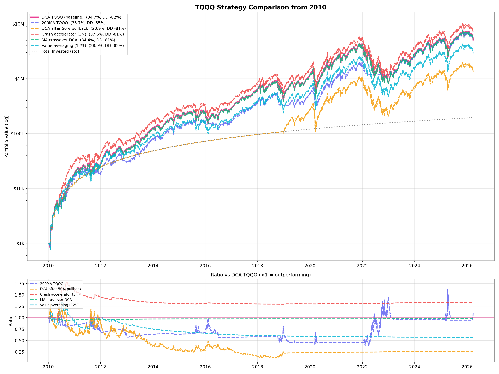

# Leveraged ETF Backtests

Backtesting DCA strategies for leveraged ETFs (SPY/SSO/UPRO and QQQ/QLD/TQQQ) using simulated prices from historical index data going back to 1928 (S&P 500) and 1985 (Nasdaq-100).

**Live interactive dashboard:** [dashboard-nine-eta-26.vercel.app](https://dashboard-nine-eta-26.vercel.app)

## Key Findings

Starting DCA of $1,000/month from 1990:

| Strategy | XIRR | Max Drawdown | Final Value |
|----------|------|-------------|-------------|
| DCA SPY | 8.3% | -55% | $2.6M |
| DCA UPRO (3x S&P) | 11.1% | -98% | $5.1M |
| 200MA UPRO | 12.3% | -66% | $6.8M |
| DCA QQQ | 13.2% | -82% | $8.5M |
| DCA TQQQ (3x Nasdaq) | 16.8% | -100% | $21.6M |
| **200MA TQQQ** | **24.0%** | **-94%** | **$138.3M** |
| 9sig TQQQ | 15.2% | -69% | $14.1M |

The 200-day moving average strategy (hold TQQQ when QQQ > 200MA, sell to cash when below) dominates across nearly all start years and time horizons.

## Strategies Tested

### Core strategies (both S&P and Nasdaq)
- **DCA** — Buy $1,000/month of the ETF regardless of market conditions
- **9-Signal** — Maintain a target growth line (9%/yr); sell when portfolio exceeds target, buy when below; hold cash reserve
- **200MA** — Hold leveraged ETF when underlying index is above its 200-day moving average; sell to cash when below

### Alternative TQQQ strategies
- **DCA after 50% pullback** — Sit in cash until TQQQ drops 50% from ATH, then start DCA
- **Crash accelerator (3x)** — Normal DCA but triple contribution when TQQQ is >30% below ATH
- **MA crossover DCA** — Only DCA into TQQQ when QQQ > 200MA, else accumulate cash
- **Value averaging (12%)** — Target 12% annual portfolio growth, adjust contributions accordingly
- **MA band +/-2% switch** — Like 200MA but with 2% hysteresis band to reduce whipsaws

## Results

### Simulated leveraged ETF prices

Prices are simulated from daily index returns applying the appropriate leverage ratio, expense ratio, and borrowing costs.

**S&P 500 family (1928-2025):**



**Nasdaq-100 family (1985-2025):**



### Portfolio growth — all strategies

**From 1990 (log scale):**



**From 2000 (survived dot-com crash + GFC):**



**From 2000 (linear scale — shows magnitude differences):**



### TQQQ strategy comparisons

**From 1986 (full Nasdaq history):**



**From 2000 (dot-com crash start):**



**From 2010 (bull market):**



### XIRR sensitivity by start year

The 200MA TQQQ strategy outperforms plain DCA TQQQ in nearly every start year from 1985-2015, with average XIRR of 28.2% vs 24.7%:

| Start | DCA TQQQ | 200MA TQQQ | Crash Accel. |
|-------|----------|-----------|-------------|
| 1986 | 16.2% | 23.6% | 19.7% |
| 1990 | 16.8% | 24.0% | 20.7% |
| 1995 | 17.3% | 23.1% | 21.2% |
| 2000 | 20.3% | 24.3% | 25.3% |
| 2005 | 25.2% | 29.6% | 31.0% |
| 2010 | 34.7% | 35.7% | 37.6% |
| 2015 | 31.7% | 40.1% | 37.3% |

## How it works

### ETF price simulation
Real leveraged ETFs (SSO, UPRO, QLD, TQQQ) have limited history. We simulate them from index data by applying daily:
- Leveraged return: `leverage × daily_index_return`
- Expense ratio drag: `-(expense_ratio / 252)` per day
- Borrowing cost: `-(borrow_rate × (leverage - 1) / 252)` per day

This captures volatility decay, the key feature of leveraged ETFs.

### XIRR calculation
Standard CAGR doesn't work for DCA strategies since money enters at different times. We use XIRR (Extended Internal Rate of Return) which accounts for the exact timing of each $1,000 monthly contribution and the final portfolio value.

### Important caveats
- Both indices are **price-only** (no dividends), understating returns by ~2%/yr
- Simulated ETF prices approximate real-world tracking but don't capture all costs (e.g., bid-ask spreads, rebalancing slippage)
- The 200MA strategy assumes same-day execution at the MA crossover — in practice you'd need to check daily
- Past performance does not predict future results

## Files

| File | Description |
|------|-------------|
| `leveraged_etf_backtest.py` | Core engine: price simulation, DCA/9sig/200MA strategies, XIRR, plotting |
| `tqqq_strategy_comparison.py` | Alternative TQQQ strategy comparisons with plots |
| `generate_dashboard_data.py` | Generates `dashboard/data.json` for the interactive Plotly dashboard |
| `GSPC_daily.csv` | S&P 500 daily prices (1928-2025) |
| `NDX_daily.csv` | Nasdaq-100 daily prices (1985-2025) |
| `dashboard/` | Interactive Plotly.js dashboard ([live](https://dashboard-nine-eta-26.vercel.app)) |

## Usage

```bash
# Run full backtest (generates all plots)
python leveraged_etf_backtest.py

# Run TQQQ strategy comparison
python tqqq_strategy_comparison.py

# Regenerate dashboard data
python generate_dashboard_data.py
```

Requirements: `numpy`, `pandas`, `matplotlib`
